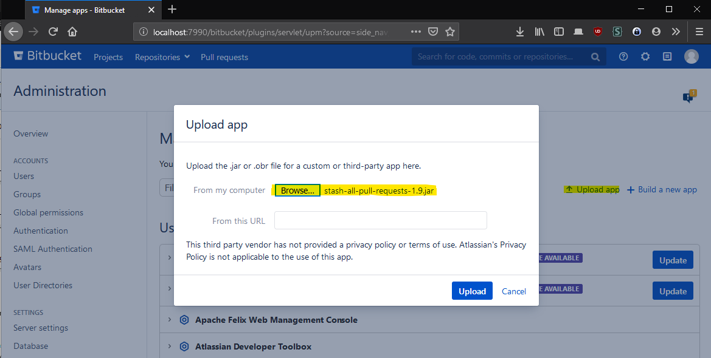

Forked from the [original](https://bitbucket.org/infusiondev/bitbucket-all-pull-requests-extra/src/master/), with [goochjj's Bitbucket 6 fix](https://bitbucket.org/goochjj/bitbucket-all-pull-requests-extra/branch/BB6)  
Zip file uploaded to [Releases](https://github.com/mendhak/bitbucket-all-pull-requests/releases) 

All Pull Requests Add-on for Atlassian Bitbucket Server with Mergeability status
=====================================================================

]

It displays as an icon information about what is blocking you to do the merge:

 * Insufficient branch permissions
 * Not all required builds are successful yet
 * Requires approvers
 * Resolve all merge conflicts first
 * Requires all tasks to be resolved

# Installing

Download a .jar from the [releases](https://github.com/mendhak/bitbucket-all-pull-requests/releases) page.

In Bitbucket, go to *Manage Apps* and choose to *Upload App*

You can then upload the .jar. 

# Development 
-----------

## ~/.m2/settings.xml

This may not be necessary, but I had to copy the `m2_settings.xml` file to `~/.m2/settings.xml` to get `atlas-` commands to work.  The purpose is to add the atlassian mirror, even though it's defined in the pom.xml. 

   
      <mirrors>
      <mirror>
        <id>central-proxy</id>
        <name>Local proxy of central repo</name>
        <url>https://maven.atlassian.com/repository/public</url>
        <mirrorOf>central</mirrorOf>
      </mirror>
      </mirrors>

## Build the jar

    atlas-package

This will create a `bitbucket-all-pull-requests-1.9.jar` in the target/ directory.  

## Run the jar in Bitbucket

    atlas-run

This builds the plugin and also creates a Bitbucket instance and installs the plugin. 

Browse to http://localhost:7990/bitbucket,  then login with `admin/admin` and then click 'Pull Requests' at the top.  

## Useful Atlassian SDK commands:

* atlas-package -- builds the .jar in the `target/` directory
* atlas-run   -- installs this plugin into the product and starts it on localhost
* atlas-debug -- same as atlas-run, but allows a debugger to attach at port 5005
* atlas-cli   -- after atlas-run or atlas-debug, opens a Maven command line window:
                 - 'pi' reinstalls the plugin into the running product instance
* atlas-help  -- prints description for all commands in the SDK

Full documentation is always available at:
https://developer.atlassian.com/docs/getting-started

## To Release 

    atlas-mvn release:prepare release:perform

This appears to perform some versioning convention in Java/Maven I'm not familiar with, where the `-SNAPSHOT` is removed and the branch is tagged. 
It also attempts to release to bitbucket.org.  

Instead I'll just create `-SNAPSHOT.jar` builds and attempt to use those.  Hopefully this has no adverse effects.  